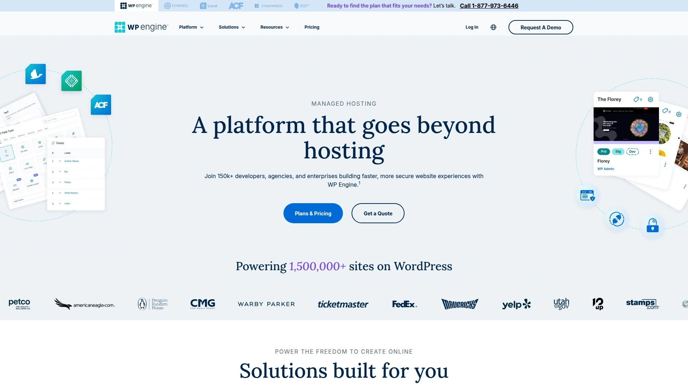
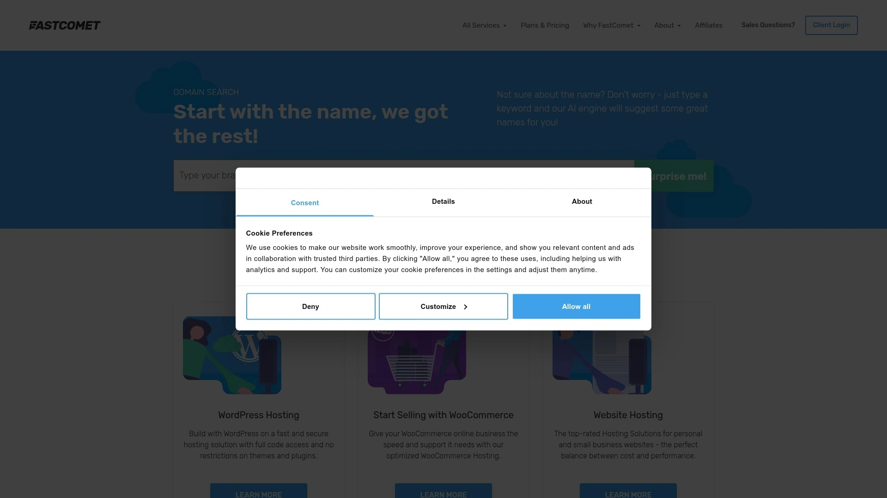

# Top 20 Managed WordPress Hosting Providers in 2025 (Latest Compilation)

Choosing the right managed WordPress hosting is critical for a fast, secure, and hassle-free website. Whether you’re a blogger, online store owner, or agency managing client sites, you need a host that delivers **speed, uptime, and great support** without headaches. Below we’ve compiled the top options in 2025 that actually live up to their promises – from lightning-fast platforms to budget-friendly providers – so you can **boost performance, tighten security, and scale your WordPress site with confidence**. Each host here offers something unique to fit different needs, helping you save time and avoid the pain of slow load times or constant troubleshooting.

## **[Rocket.net](https://rocket.net)**
*Lightning-fast edge platform for WordPress, ideal for high-traffic sites needing top security.*

Rocket.net is a premium all-in-one hosting solution built specifically for WordPress speed and security. It comes **integrated with Cloudflare Enterprise CDN** at no extra cost, meaning your site content is served from edge servers worldwide for blazingly fast load times. Enterprise-grade security is baked in – including a web application firewall (WAF) and real-time malware protection – so you don’t need to juggle extra plugins for safety. Managing websites is a breeze with Rocket’s clean dashboard, and they handle all the heavy lifting (from core updates to performance tuning) for a truly managed experience.

- **Performance on steroids:** Rocket.net pre-configures caching and includes their built-in CDN to deliver sub-second page loads. Even during traffic spikes, the platform keeps response times amazingly low.
- **Security-first approach:** Every plan has always-on WAF, daily malware scanning, and automatic updates, so your WordPress sites stay safe without you lifting a finger.
- **White-glove support:** You get 24/7 expert support (they’re WordPress pros) and free migrations. Many users rave that even the CEO might jump in on support chats to solve issues, reflecting how seriously they take customer success.

*Why we recommend it:* If you refuse to compromise on performance and want a **hands-off hosting** where speed optimization and security are already handled, Rocket.net is worth the investment. It’s perfect for businesses and agencies who need top-tier hosting that **just works**, allowing you to focus on content and growth instead of caching plugins and server tweaks.

## **[Kinsta](https://kinsta.com)**
*Premium Google Cloud-based hosting with superb support, great for growing businesses and developers.*

Kinsta has made a name for itself by offering **managed WordPress hosting on the Google Cloud Platform**, ensuring high reliability and scalability. Your sites are hosted on cutting-edge infrastructure (like the same C2 machines powering Google’s own services), which translates into excellent speed and uptime. Kinsta’s custom dashboard is very user-friendly – you can manage multiple sites, deploy staging environments with one click, and monitor resource usage easily. They cater to developers too, with features like SSH access, Git integration, and WP-CLI support out of the box.

What sets Kinsta apart is its **focus on customer experience and optimization**. They have a talented support team available 24/7 (via chat) composed of WordPress experts who typically resolve issues quickly. Kinsta also automatically handles daily backups, uptime monitoring, and malware scans for you. If your site suddenly gets a traffic surge, Kinsta’s isolated container infrastructure scales up resources behind the scenes to keep things running smoothly.

Despite being a premium service (starting at $35/month), it’s **ideal for high-traffic blogs, corporate sites, or online stores** that can’t afford downtime or slow speeds. You get built-in Cloudflare integration, a global CDN, and an array of optimization tools that make WordPress fly. In short, Kinsta gives you enterprise-level performance in a package that’s simple enough for non-techies and powerful enough for seasoned developers.

## **[WP Engine](https://wpengine.com)**
*Enterprise-grade WordPress platform, developer-friendly and trusted for mission-critical sites.*

WP Engine is one of the pioneers of managed WordPress hosting, trusted by large enterprises and popular bloggers alike. It provides a rock-solid environment fine-tuned for WordPress, so you get **excellent uptime, security, and speed** without needing to configure anything. Their platform uses an advanced caching system (EverCache) and a global CDN, resulting in quick load times even when your content is heavy or traffic is spiking.

Some highlights of WP Engine include:

- **Robust development tools:** Every plan comes with easy **staging sites** (to test changes before going live) and built-in Git version control. This is a big plus for developers or anyone maintaining a professional site where you can’t afford mistakes on the live version.
- **Top-notch security & backups:** WP Engine automatically updates WordPress core and offers threat detection and blocking. They perform daily backups of your sites (with one-click restore), so your data stays safe. If by chance your site is hacked, they’ll fix it for free.
- **Scalability:** Whether you run a tiny blog or a huge e-commerce store, WP Engine’s infrastructure scales to your needs. Their higher-tier plans and add-ons can handle millions of visitors, and you can upgrade seamlessly as you grow.

*Who should use WP Engine?* It’s perfect for those who run **high-importance websites** – like major blogs, membership sites, or business websites – where performance and reliability are non-negotiable. While it’s pricier than generic shared hosting, you’re paying for peace of mind. With WP Engine, you have a partner that takes care of the technical heavy lifting (caching, security, updates), so you can concentrate on content and business strategy.

## **[SiteGround](https://siteground.com)**
*Reliable all-round hosting on Google Cloud, perfect for beginners and small businesses.*

SiteGround is a highly respected host known for its balance of performance, features, and price – making it a favorite for many WordPress users from beginners to medium-sized businesses. It runs on the **Google Cloud infrastructure**, which means fast network and SSD storage for all plans, contributing to great site loading times. SiteGround’s in-house optimizations also shine: their custom **SG Optimizer plugin** works with their platform to provide dynamic caching, image optimizations, and PHP speed tweaks, helping even a basic WordPress site run remarkably fast.

For newcomers, SiteGround offers an extremely smooth experience. The interface is clean and welcoming, and you have one-click WordPress installs, a guided website setup, and even a built-in WordPress Starter wizard to install popular plugins/features you might need. Customer support is one of SiteGround’s strongest points – their 24/7 live chat and ticket support is famously quick and knowledgeable (they’re often praised for going the extra mile, even on tricky WordPress issues).

SiteGround includes daily backups, free SSL certificates, and a free CDN integration. They also take security seriously, with proactive server monitoring and a custom firewall to protect against WordPress vulnerabilities. While SiteGround’s initial prices are affordable, note that renewals are at regular rates – still, the reliability and service quality justify the cost for many. It’s an excellent all-purpose host for WordPress, especially if you want **speed and reliability but don’t have a system admin background**. You can have peace of mind that your site is in good hands while you focus on building your content or business.

## **[Cloudways](https://cloudways.com)**
*Flexible multi-cloud hosting with managed convenience, great for agencies and power users.*

Cloudways is a unique beast in the hosting world – it lets you deploy WordPress on top of your choice of cloud providers (like DigitalOcean, AWS, Google Cloud, Vultr, or Linode) via a managed platform. In essence, **you get cloud VPS performance without needing DevOps skills**, because Cloudways handles the server setup, security patches, and maintenance for you. This offers incredible flexibility: you can pick the data center location and specs that suit your project and budget, and scale resources up or down as needed.

Here’s why Cloudways is loved by many freelancers and agencies managing multiple sites:

- **Managed, but with control:** You have a simple dashboard to launch servers and apps, and you can tweak PHP versions, run database optimizations, or schedule automated backups with a few clicks. It’s not as locked-down as some managed hosts – you still get SFTP/SSH access, database management, and the ability to install custom plugins or applications.
- **Performance-focused stack:** Cloudways comes with an optimized stack (NGINX + Apache hybrid server, MariaDB, and Redis/Memcached caching options). It also includes the Breeze cache plugin and supports Cloudflare CDN integration for speeding up your WordPress sites. You can enable their built-in **CloudwaysCDN** or easily use a service like Cloudflare – either way, global content delivery is straightforward.
- **Pay-as-you-go pricing:** There are no fixed plans; you pay for the exact server resources you allocate on a monthly basis. This means if you host multiple small sites, it can be very cost-effective. Plus, no long-term contract – you can shut down servers or change plans at any time.

One thing to note: Cloudways doesn’t include email hosting (you’d use an add-on or separate service for that), and very beginners might find the choices overwhelming at first. However, for those who want **more power and flexibility than typical shared hosting** without managing a raw cloud server, Cloudways is a perfect middle ground. It’s like having a technical ops team set up and tune your servers, while you still retain the freedom to configure your applications as you wish.

## **[Nexcess](https://www.nexcess.net)**
*Ecommerce-optimized WordPress hosting by Liquid Web, fine-tuned for WooCommerce and dynamic sites.*

Nexcess (a Liquid Web brand) offers managed WordPress and WooCommerce hosting that’s tailored for **sites with heavy workloads – from busy online stores to membership or elearning sites**. If you’re running WooCommerce, Nexcess is particularly enticing: their platform includes specific performance optimizations for it, like advanced caching that knows how to handle dynamic cart and checkout pages, and even a built-in Elasticsearch option for lightning-fast product search. They also offer an **auto-scaling feature** – if you suddenly get a traffic spike (say a holiday sale goes viral), Nexcess will automatically allocate extra resources to keep your store running smoothly, and then scale them back down (short-term scaling doesn’t even incur extra charges, which is great).

Beyond e-commerce perks, Nexcess provides all the conveniences of good managed WordPress hosting. You get a user-friendly portal, one-click staging sites, nightly backups, and free SSL certificates. Security is strong with constant monitoring and a guarantee to help fix any hacked site issues. They also do **plugin updates for you automatically** (through a feature called Visual Compare that even checks if an update might break your site). This is a huge time-saver if you maintain a lot of plugins.

With data centers across North America, Europe, and beyond, you can choose a region that’s best for your audience. And because it’s backed by Liquid Web, you can expect **24/7 heroic support** that’s well-versed in WordPress. Nexcess plans start a bit higher than generic hosts, but considering the **no overage fees, the WooCommerce enhancements, and the robust infrastructure**, it provides excellent value for serious sites that make you money. In short, if you have a growing store or dynamic WordPress site and want a host that proactively boosts your site’s speed and stability (and saves you from plug-in maintenance chores), Nexcess should be on your list.

## **[Pressable](https://pressable.com)**
*Managed hosting by Automattic, seamless Jetpack integration and a focus on reliability.*

Pressable stands out because it’s **owned by Automattic**, the company behind WordPress.com, WooCommerce, and Jetpack. That pedigree brings a lot of benefits in terms of reliability and integration. For instance, every Pressable plan comes with the Jetpack Security Daily plugin suite included for free (which gives you daily backups, malware scanning, and spam protection – nice extras you’d otherwise pay for). It’s safe to say Pressable knows WordPress inside out, and their platform is tuned for optimal performance and uptime. They even use the same data centers that power WordPress.com, so you’re in good company infrastructure-wise.

Key advantages of hosting on Pressable include:

- **Excellent onboarding and management:** The interface is clean, and setting up a new WordPress site is straightforward. They offer unlimited free migrations – their team will move your existing sites over to Pressable for you, which is super helpful if you’re not comfortable doing it yourself.
- **Great for agencies/multiple sites:** Most Pressable plans let you host several WordPress sites on one account. They also have a convenient feature where you can **collaborate and give client access** to specific sites without sharing your own credentials. If you’re an agency or freelancer, this multi-site management capability plus their bulk pricing can be a big money saver.
- **Automattic’s support network:** Support is 24/7 and handled by WordPress experts (naturally, since it’s Automattic). If you have WooCommerce or Jetpack questions, they can help with those too. Essentially, it’s like having the WordPress core team’s extended family as your support department.

Overall, Pressable is a solid choice if you want **worry-free managed hosting with a touch of the WordPress.com ecosystem**. It may not have flashy advertising, but its performance and support quality speak for itself. This host is particularly recommended for those who value stability and close integration with WordPress products (like if you’re already using WooCommerce or Jetpack, Pressable will feel like home).

## **[WPX](https://wpx.net)**
*Ultra-fast hosting with personal support, known for speedy responses and a custom CDN.*

WPX is a favorite among many affiliate marketers, bloggers, and small businesses who need speed on a budget. It’s not as expensive as some enterprise hosts, but it still delivers impressive performance – often outpacing bigger names – thanks to an optimized stack and their own content delivery network called **WPX XDN**. This global CDN (with over 30 endpoints) is included free, which means your images and static content load quickly from servers nearest to your visitors. WPX’s focus is clearly on **speed and simplicity**: they only offer a few plans (no endless confusing tiers), all of which are fully managed WordPress environments with features like staging, nightly backups, and malware scanning.

Perhaps the most raved-about aspect of WPX is their customer support. They have a mantra of answering live chats within 30 seconds, and in practice it often feels that fast. The support team is small but incredibly effective – they’ll stick with you through issues and even do hands-on fixes (like optimizing your site or cleaning malware) without pointing fingers. This personal, can-do support ethos is a refreshing change from the big hosts where you might feel like just another ticket number.

Other notable points: WPX allows multiple websites on even their base plan (5 sites on the Basic plan), which is great if you manage several projects. They provide free unlimited site migrations, so you can bring all your WordPress sites over without hassle. Security is handled proactively; if any of your sites get hacked, WPX promises to fix it for free, which shows their confidence in their defenses.

In short, WPX is perfect for **those who crave fast load times and responsive support** but don’t want to pay a fortune. It’s especially appealing to bloggers and online entrepreneurs running revenue-generating sites – WPX helps keep those sites snappy and safe, which can directly boost your SEO and user engagement. And when you need help, it’s like having an expert friend on call 24/7, rather than slogging through tiered support hierarchies.

## **[DreamHost](https://www.dreamhost.com)**
*Reliable WordPress hosting officially recommended, with a beginner-friendly panel and affordable plans.*

DreamHost is one of the few hosts officially endorsed by WordPress.org, and it’s easy to see why: they’ve been hosting WordPress sites for decades with a strong track record of performance and customer satisfaction. DreamHost offers both budget-friendly shared plans and managed WordPress solutions (branded as DreamPress) to cater to different needs. What’s great is that even their basic plans come with **unlimited bandwidth, a free domain for the first year, and free SSL**, making it a cost-effective choice for new bloggers or small businesses. Plus, they have an unbeatable 97-day money-back guarantee on shared hosting, showing how confident they are in their service.

One thing that sets DreamHost apart is its **custom control panel**. It’s not cPanel – DreamHost has its own sleek panel that many find more intuitive. From there, you can easily install WordPress (if it isn’t preinstalled), manage email accounts, set up domain DNS, and control backups. WordPress updates can be automated, and if you opt for DreamPress, you get extras like built-in caching, isolated resources for your site (for better stability), and on-demand backups. DreamPress plus plans even include Jetpack Professional (for backups and security scanning) at no extra charge, which is a nice perk.

DreamHost’s support is available 24/7 via live chat and email tickets. While they don’t have phone support by default, they make up for it with detailed knowledge base articles and a very helpful support team that knows WordPress well. They’re also a very **ethically minded company** – actively contributing to WordPress development and supporting internet freedom causes, which resonates with some users.

All in all, DreamHost is an excellent choice if you want **straightforward, reliable hosting with WordPress-specific optimizations**. It’s especially friendly for beginners (no upsells shoved in your face, and a clear interface), while still providing the performance and features that more seasoned users need. Whether you’re launching your first blog or looking to host a busy site on their DreamPress platform, DreamHost provides a stable, transparent hosting experience.

## **[Hostinger](https://www.hostinger.com)**
*Budget-friendly hosting with premium speed tech, great for entry-level WordPress sites globally.*

Hostinger has managed to carve out a reputation as one of the **best low-cost hosts** that doesn’t feel “cheap” in quality. If you have a tight budget but still care about performance, Hostinger is incredibly appealing. Their plans start just a couple of dollars a month, yet they include modern features like **LiteSpeed servers** (with the LSCache plugin for WordPress acceleration), which drastically improve loading times compared to typical bargain hosts. They also have a global presence with several data centers across Europe, Asia, North and South America — perfect if your audience isn’t just in one region.

Using Hostinger is straightforward thanks to their custom-built control panel called **hPanel**. It’s very beginner-friendly, with one-click WordPress installs and an auto-installer for other apps, easy DNS zone management, and clear options for things like enabling SSL or Cloudflare CDN. Despite the low prices, Hostinger doesn’t skimp on freebies: you get a free SSL certificate on all plans, and higher-tier shared plans even throw in a free domain name and daily backups. They also recently introduced a Website Builder and have a library of WordPress tutorials, so newcomers get a helping hand in site building.

Performance-wise, Hostinger sites benefit from that LiteSpeed web server (which is known for handling concurrent traffic efficiently). The caching plugin will help even a media-rich WordPress site feel snappy. While the resource limits on entry plans are obviously lower than premium hosts, for small to medium sites Hostinger often exceeds expectations – pages load quickly and uptime stays around 99.9% as promised. Support is 24/7 via chat; it’s generally responsive, though at peak times you might wait a bit due to the volume of global users.

In summary, Hostinger is **ideal for beginners, personal sites, or anyone looking to host multiple small WordPress sites without breaking the bank**. It proves that you don’t have to pay a fortune for reliable, fast hosting. As long as you set realistic expectations (it’s not going to beat a Kinsta or WP Engine in raw power), you’ll likely be pleasantly surprised at what Hostinger delivers for the price.

## **[Bluehost](https://www.bluehost.com)**
*User-friendly WordPress hosting officially recommended, with one-stop domain and hosting convenience.*

Bluehost is another host **endorsed by WordPress.org** and is often the first stop for beginners launching a WordPress site. They make the process really simple: when you sign up, you can register a domain (free for the first year), and WordPress will be automatically installed for you – you’re essentially ready to start building your site within minutes. Bluehost’s custom dashboard integrates with the standard cPanel, but they’ve streamlined common WordPress tasks, so even a non-technical user can manage things like setting up a staging site or enabling a CDN without confusion.

Here are some reasons Bluehost continues to be so popular, especially among newcomers:

- **All-in-one convenience:** Because they offer domains, hosting, and even email, you have a single place to manage all aspects of your website. No fiddling with pointing DNS to another host; it’s all handled. This is great if you’re not familiar with the technical side of things.
- **Guided experience:** Bluehost provides a neat guided setup for WordPress. It will suggest themes, help install useful plugins (like contact forms or SEO plugins) based on the site goals you indicate. It’s like having a basic coach walking you through initial setup.
- **Resource generosity:** Most Bluehost plans (even basic) let you host multiple sites and give **unmetered bandwidth**. Storage is ample for a typical site. While they use shared hosting for basic plans, they also have an upgraded “WP Pro” managed WordPress tier for those who need more performance and resources as their site grows.

Performance-wise, Bluehost is solid for small-to-medium sites. It might not be the very fastest out-of-the-box (since it doesn’t include advanced caching by default on basic plans), but it’s stable. They do include Cloudflare integration in the panel, so you can enable that for a quick speed boost and extra protection. Security updates and patches are taken care of automatically. And if anything goes wrong, Bluehost support is available 24/7 via phone or chat – which is reassuring if you suddenly face an issue at 2 AM.

To sum up, Bluehost offers **a friendly, one-stop hosting experience for WordPress**. It’s perfect if you’re just starting and want a reputable host that “just works” without requiring much effort. Millions of users have launched their first website with Bluehost because it’s straightforward and backed by a big name in the industry, giving you the confidence to focus on your content rather than server tinkering.

## **[HostGator](https://www.hostgator.com)**
*Affordable and straightforward hosting with unlimited resources, ideal for personal or starter websites.*

HostGator is a veteran in the budget hosting space and has long been a go-to option for folks looking to host WordPress on a shoestring budget. They offer very **low entry prices, generous storage and bandwidth**, and the comfort of a well-known brand. If you have a personal blog, a portfolio site, or a small business website that you need to get online quickly and cheaply, HostGator fits the bill. With one-click WordPress installation via Softaculous and a standard cPanel interface, it’s a familiar environment for anyone who’s used shared hosting before.

Despite the low cost, HostGator packs in useful features for WordPress users: you get a free SSL certificate (a must-have these days), easy integration of Cloudflare CDN through cPanel, and they have their own **WordPress optimization plugin** (though you can choose others if you prefer). For those who might outgrow the basic shared plan, HostGator provides an upgrade path – including a WordPress-specific hosting tier called “WordPress Cloud” which offers better performance and isolated resources, as well as VPS and dedicated servers for when you really scale up. The nice thing is you can stay within the HostGator ecosystem as your site needs more power, migrating seamlessly to higher plans.

HostGator’s support is 24/7 via chat, phone, and email. They have a large knowledge base and even community forums where common issues are discussed. While the support quality can sometimes be hit-or-miss (due to the volume of customers they have), they generally resolve standard issues efficiently. The host also provides a 99.9% uptime guarantee and a 45-day money-back guarantee, indicating they stand by their service reliability.

In a nutshell, HostGator is **all about value and simplicity**. It doesn’t come with the fancier bells and whistles of premium managed hosts, but it offers a dependable way to host a WordPress site without spending much. It’s particularly well-suited for beginners, students, or hobbyists who want a stable online presence and might appreciate unlimited storage for lots of photos or media. If you keep your expectations reasonable (i.e., it’s not built for ultra-high traffic out of the gate), HostGator will serve you well as a cost-effective starting point on your WordPress journey.

## **[GreenGeeks](https://www.greengeeks.com)**
*Eco-friendly hosting powered by 100% renewable energy, without compromising on speed or support.*

GreenGeeks is the hosting provider for those who care about the environment and want to **minimize their carbon footprint**. They’ve committed to replacing 3 times the energy they consume with energy from renewable sources (via credits), which effectively makes your website’s hosting carbon-reducing. But GreenGeeks isn’t just about the green mission – they also deliver a hosting service that competes well with other providers on performance and features. Every WordPress hosting plan includes **unlimited SSD storage and bandwidth**, a free domain for the first year, free Wildcard SSL, nightly backups, and even a free CDN integration. It’s a full-featured offering that covers all the basics and then some.

When it comes to using GreenGeeks for WordPress, you’ll find they have the one-click installer for WordPress, or you can opt to have WordPress pre-installed when you sign up (saves you a step). They also maintain their own optimization plugin and handle important security aspects like automatic core updates and real-time security scanning to protect against malware. Performance is aided by built-in caching technology and the fact that their servers run on LiteSpeed (for most plans), which as mentioned earlier, is great for WordPress sites under load. GreenGeeks gives you the cPanel interface, which means if you’re migrating from another cPanel host, it’s familiar territory.

Support is available 24/7 via chat and email (tickets), and via phone during business hours. They’re known to be quite responsive and helpful, often assisting with WordPress-specific queries. With data center locations in the US, Canada, and Europe, you can choose where to host your site for optimal latency to your audience.

GreenGeeks is an excellent choice for **eco-conscious bloggers and businesses** — you can tout that your site is hosted green, which might even appeal to your audience. But even if going green is a bonus rather than the primary goal, GreenGeeks holds its own as a reliable host with fast servers and all the WordPress-friendly features you’d expect. It shows that being environmentally responsible doesn’t mean sacrificing quality or speed when it comes to web hosting.

## **[A2 Hosting](https://www.a2hosting.com)**
*Performance-focused host with Turbo servers and dev-friendly features for demanding WordPress users.*

A2 Hosting has a strong reputation among developers and tech-savvy site owners who crave speed and control. If you’re the kind of person who likes to squeeze every ounce of performance out of your WordPress site (or you just want it to be really, really fast without much effort), A2 is worth a look. Their hallmark offering is the **Turbo Servers** available on higher-tier plans – these come with an optimized LiteSpeed-based stack, NVMe SSD storage, and the A2 Optimized caching plugin, all of which can make WordPress pages load insanely fast (we’re talking noticeable differences, especially under heavy traffic, compared to standard shared plans).

Even on the lower plans, A2 Hosting gives you a lot of perks: unlimited SSD storage, free SSL, and free site migrations. They also shine in the realm of advanced features: you get SSH access on essentially all plans, which is great for running WP-CLI commands or Git deployments. They support multiple versions of PHP (and you can switch easily), plus databases, Node.js, Python, etc., so you’re not limited if you’re running more than just WordPress. For WordPress specifically, they have one-click staging (on managed plans), automatic updates, and their security setup includes dual firewalls, brute force defense, and virus scanning to keep your site safe.

The A2 Hosting support team (dubbed the “Guru Crew”) is available 24/7 and is generally very knowledgeable, particularly with technical issues. They offer support via chat, phone, and tickets. One thing A2 also boasts is an “anytime” money-back guarantee – basically a pro-rated refund if you cancel after the initial 30-day full refund window. This is quite uncommon and shows their confidence in customer satisfaction.

Overall, A2 Hosting is **perfect for those who demand high performance or want more control** over their hosting environment. If you are an experienced user, you’ll appreciate the freedom A2 provides (you can even choose which data center – US, Europe, or Asia – to host in). Beginners can also use A2 with ease, but they’ll especially feel the benefits in site speed, which can improve SEO and user experience. It’s a host that truly emphasizes the “turbo” in WordPress performance, while also keeping things secure and stable.

## **[FastComet](https://www.fastcomet.com)**
*Globally distributed hosting with transparent pricing, delivering solid WordPress speed and support.*

FastComet might not have the same brand recognition as some big hosts, but it has steadily grown a loyal customer base by offering high-quality hosting with a few standout advantages. Firstly, FastComet has **10+ data centers across the globe** (USA, Europe, Asia, and even Oceania), which means you can host your WordPress site as close to your target audience as possible – a key factor for speed. They also partner with Cloudflare, giving every customer free CDN integration to further boost global content delivery. All servers run on speedy SSD storage, and FastComet includes their own caching system plus support for PHP 8+ for performance.

One thing customers love: **FastComet doesn’t jack up the price on renewal**. The price you sign up for is the price you renew at, which is a rarity in the hosting world (no sudden 2x or 3x price surprises after your first term). This transparent pricing policy builds a lot of trust. Speaking of trust, their support is frequently praised – available 24/7 via chat and tickets, with quick response times and a hands-on attitude. They assist with WordPress transfers for free and will even help with some troubleshooting or optimization advice if you ask. It’s like having a friendly tech team on standby.

Every WordPress hosting plan on FastComet comes loaded with features: daily automatic backups (with 7 or 30-day retention depending on plan), free domain transfer (if you have one, they’ll renew it for you), free SSL, and robust security including a web application firewall and malware scanning. They give you cPanel for management, which many users find convenient and familiar. Additionally, if email hosting matters to you, FastComet includes unlimited email accounts, unlike some newer hosts that offload email to external services.

FastComet is a **great all-rounder choice** – it’s fast, it’s honest about pricing, and it treats customers well. It works especially well for small businesses, community sites, or anyone who might be serving an international audience (since you can host in regions like India, Japan, Singapore, etc., not just the typical US/EU options). In summary, FastComet offers premium hosting touches at a mid-range price, all while keeping things user-friendly for WordPress site owners.

## **[GoDaddy](https://www.godaddy.com)**
*Popular one-stop provider for domains and hosting, offering convenient WordPress plans for beginners.*

GoDaddy is the big name almost everyone on the internet has heard of – they manage over 80 million domain names and have a huge presence in the hosting market as well. One advantage of choosing GoDaddy for WordPress hosting is **simplicity and integration**. If your domain is registered with GoDaddy, getting your WordPress site live is literally a matter of a few clicks, since the domain and hosting configurations are handled automatically. They offer a range of WordPress-specific plans that include managed services such as automatic WordPress core/software updates, daily backups, and a staging site for testing changes.

For someone new to WordPress, GoDaddy’s onboarding process is quite helpful. They have an option to pre-build your site with a few templated pages (using their bundled themes and plugins) based on the category of site you’re creating – kind of a starter framework you can then tweak. Their interface is straightforward, and common tasks like creating email accounts, setting up an online store with WooCommerce (available on higher-tier plans), or enabling an SSL certificate are made simple. Another perk: GoDaddy has **24/7 phone support** in many local languages, which is relatively unique. If you prefer talking through an issue on a call, that’s something GoDaddy provides that a lot of hosts don’t nowadays.

In terms of performance, GoDaddy’s WordPress plans have made strides. They now include built-in caching and handle traffic pretty well for moderate use cases. While a high-traffic site might eventually outgrow GoDaddy’s shared environment, small business websites, personal blogs, or portfolio sites typically run fine. And if you need to scale, GoDaddy also offers a Pro program and even a dedicated WordPress Ecommerce hosting tier with more resources.

To sum up, GoDaddy is **ideal for beginners or those who prioritize convenience**. You can manage your domain, hosting, and even things like Office 365 email all in one place. This one-stop-shop approach means less technical juggling. GoDaddy might not have the ultra-specialized performance tweaks of a boutique host, but it covers all the bases for getting a WordPress site up quickly and keeping it running with minimal fuss. For many users, especially first-timers, that’s a trade-off worth making.

## **[EasyWP by Namecheap](https://www.easywp.com)**
*Ultrafast cloud WordPress hosting with cPanel-free simplicity, at a fraction of typical costs.*

EasyWP is Namecheap’s managed WordPress hosting service, and it lives up to its name by making WordPress setup **extremely easy and fast**. If you’re intimidated by traditional hosting dashboards or want to avoid dealing with cPanel altogether, EasyWP offers a refreshing approach: you literally can deploy a new WordPress site from a simple interface in seconds, and manage all your sites from one clean dashboard. There’s no need to mess with databases or FTP – it’s all streamlined.

Despite the simplicity, the performance is impressive for the price. EasyWP runs on Namecheap’s cloud infrastructure, using lightweight containers for each WordPress site. This means resources are isolated and optimized for WP. They advertise the ability to handle up to 50k visitors monthly on the starter plan, which is plenty for a new or small site. You also get a free CDN (through Namecheap’s partnership) which is as simple as a toggle to turn on, further boosting your site speed globally. Basic caching is built-in at the server level, and you can always add a plugin like LiteSpeed Cache or WP Super Cache if needed (though many users find EasyWP’s out-of-box performance is already solid).

A few more perks: EasyWP includes free SSL and free domain integration with Namecheap domains (naturally, since it’s their service, connecting a Namecheap domain is effortless). There’s also a very generous free trial – you can often start an EasyWP site for **$0 for the first month** to test it out. Backups can be made on demand (and they do routine backups as well), and restoring from a backup is done in a couple of clicks should anything go wrong.

Who is EasyWP best for? It’s fantastic for **beginners, bloggers, or anyone who wants a quick WordPress test site** without investing much. Developers might even use it to spin up staging sites temporarily. The pricing is extremely affordable, especially compared to traditional managed WP hosts – you’re getting a managed experience (they handle updates and server upkeep) for the cost of many shared hosting plans. If you want to launch a WordPress site with minimal cost and effort, EasyWP is an option you’ll want to consider. It strips away the clutter and lets you get right to publishing content, which is what most website owners really care about at the end of the day.

## **[ScalaHosting](https://www.scalahosting.com)**
*Innovative host with proprietary technology (SPanel & SShield), blending VPS power with shared hosting ease.*

ScalaHosting is an interesting player that brings the firepower of cloud VPS hosting to everyone, without requiring technical expertise. They’ve developed their own **SPanel control panel** as an alternative to cPanel, which is provided for free on their managed cloud VPS plans. This is significant because it makes upgrading from a shared environment to a more robust VPS very smooth and cost-effective (no cPanel licensing fees). For WordPress users, Scala offers specific managed WordPress plans and their so-called “WordPress VPS” – which means you get dedicated resources, better security isolation, and scalability, all while managing WordPress with a friendly interface.

One of ScalaHosting’s bragging points is their **SShield security protection**. It’s an AI-driven security system that runs 24/7, blocking 99.9% of web attacks and malware before they hit your site. If anything somehow does slip through and your site gets compromised, SShield will notify their team and help you resolve it quickly. Basically, it’s like having a smart security guard for your website at all times. In terms of performance, because you can easily move to a VPS with Scala, your site can enjoy more CPU/RAM as needed, which means handling more traffic and heavy plugins becomes easier compared to being on a crowded shared server. Even on their shared plans, though, they use LiteSpeed servers, SSD drives, and provide a built-in caching plugin to keep WordPress snappy.

ScalaHosting also includes unlimited free migrations – they’ll move all your sites from your old host for you, which is great if you’re managing multiple WordPress blogs or client sites. Their support (available 24/7 via chat and tickets) often draws praise for being quick and effective; since they’re a bit smaller and very customer-focused, you often get more personalized attention. They also give you daily backups stored remotely for disaster recovery peace of mind.

In summary, ScalaHosting is a top pick if you’re looking for **future-proof hosting**. Maybe you have a small site now, but you want the option to seamlessly grow into a VPS later – Scala is built for that journey. It’s also ideal for those who value innovations like SPanel (to save costs and not rely on cPanel) and who want robust security without needing to configure it themselves. WordPress runs great on ScalaHosting, and you get the kind of performance and security usually reserved for big enterprises, but within reach of a single blogger or startup. That’s a pretty compelling proposition.

## **[ChemiCloud](https://chemicloud.com)**
*Top-rated customer service and free migrations, providing reliable WordPress hosting with a personal touch.*

ChemiCloud is a lesser-known gem in the hosting industry that consistently garners **5-star ratings for its customer support and service quality**. They’ve made a splash by focusing on what customers truly want: a fast, stable website and humans who actually help when you need support. With ChemiCloud’s WordPress hosting, you’ll get all the features you’d expect: unlimited bandwidth, free Let’s Encrypt SSL, daily backups, and an easy WordPress installer. They also sweeten the deal by offering a free domain name for life – as long as you host with them, they will renew your primary domain each year for free. It’s a nice budget saver and one less task to remember.

Performance-wise, ChemiCloud uses **LiteSpeed web servers** combined with the LSCache plugin for WordPress, which, as noted earlier, is a recipe for great site loading times. They have multiple data center locations (US, Europe, Asia, and even as far as Australia), so you can choose one close to your audience for better latency. They also provide a free Cloudflare CDN setup to further accelerate global content delivery. What’s more, ChemiCloud doesn’t overcrowd their servers – they keep the client count per server relatively low for their premium plans, ensuring that your WordPress site can use the CPU and RAM it needs without lag.

Now, the hallmark: **customer support**. ChemiCloud’s support team is available 24/7 via chat and tickets, and they’re known for being extremely friendly and patient. They go beyond rote responses; if you’re confused about a plugin or need help optimizing something on WordPress, they often guide you through it or just handle it if it’s a quick fix. And if you’re coming from another host, ChemiCloud will migrate your site for free with zero downtime. Many customers report very smooth migration experiences and improved performance after switching to ChemiCloud.

All things considered, ChemiCloud is a fantastic choice for **users who value personal, high-quality support** and a worry-free hosting experience. It’s especially great if you’ve had frustrating experiences with bigger hosts’ support and want to feel like a valued customer rather than a ticket number. With a 45-day money-back guarantee, it’s relatively risk-free to try them and see the difference. Fast servers + stellar support = happy WordPress site owners, and ChemiCloud delivers on both counts.

## **[InMotion Hosting](https://www.inmotionhosting.com)**
*Business-class WordPress hosting with bold performance guarantees and a suite of features for growth.*

InMotion Hosting has been around for a long time serving everyone from small businesses to enterprise clients, especially in the US. They offer a range of WordPress hosting options, including shared WordPress plans and managed WordPress VPS plans, all designed to give you a **smooth, fast, and secure website**. One notable thing about InMotion is their confidence in quality – they provide up to a 90-day money-back guarantee (on certain plans), which is much longer than the industry standard. This generous refund policy shows they expect customers to be satisfied.

When you host WordPress with InMotion, you’ll benefit from features like:

- **BoldGrid Website Builder:** This is InMotion’s own drag-and-drop builder that sits on top of WordPress. If you’re not a design expert, BoldGrid helps you create a professional-looking site on WordPress quickly by using templates and easy customization. It’s optional, but a nice add-on for newbies who want more than a basic theme.
- **Performance optimizations:** InMotion uses fast SSD storage on all plans, and on their higher WordPress tiers, you get things like NGINX caching and possibly even Redis support for caching database queries. They’ve engineered their platform to handle traffic spikes – combined with their promise of “max speed zones” (choosing East or West coast data centers for best response times), your site is in good shape to be speedy for visitors.
- **Freebies and security:** You get a free domain, free SSL, and unlimited email accounts included. InMotion also provides hack protection, DDoS protection, and automatic backups. If you go for their managed WP plans, they include Jetpack (with backups and security scanning) and automatic plugin updates, which take a lot of maintenance off your plate.

InMotion’s support team is U.S.-based and available 24/7 via phone, live chat, and email. They have a solid rep for being helpful, and because they’ve been doing hosting for so long, they have extensive support docs and community Q&A forums as well. Another niche plus: if you’re into open-source or want to venture beyond WordPress, InMotion also supports a lot of developer-friendly features and even offers unmanaged cloud VPS for those who want that route later.

All in all, InMotion Hosting is **reliable and geared towards business and professional users**. If you want a WordPress host that takes uptime seriously (they often clock 99.99% uptime) and has the infrastructure to support an growing online business or store, InMotion is up to the task. It combines the ease-of-use features that beginners need with the performance headroom and support quality that more demanding users expect, which makes it a versatile choice to grow with.

---

### FAQ: Common Questions About Managed WordPress Hosting

**Q1: How do I choose the best WordPress hosting provider for my needs?**
**A1:** Start by assessing your site’s requirements and your own technical comfort level. If you’re a beginner with a simple blog or portfolio, look for hosts known for ease-of-use (like those with one-click setups, good support, and maybe a website builder). If you expect high traffic or run an online store, prioritize hosts with strong performance features (CDNs, caching, high uptime) and scalability. Also consider your budget – some premium hosts offer amazing speed and support but at a higher price, while others provide great value for smaller sites. Reading user reviews and looking at benchmarks can help, but the hosts on this list are all reputable options. Ultimately, weigh what matters most to you (speed, support, cost, specific features) and choose a provider that excels in that area.

**Q2: What’s the difference between shared hosting and managed WordPress hosting?**
**A2:** *Shared hosting* is a basic setup where your website shares server resources with many other sites. It’s usually cheaper, but you’re largely on your own for optimization – you might need to install cache plugins or handle updates yourself. *Managed WordPress hosting*, on the other hand, is a concierge service for WordPress. The providers fine-tune the server environment specifically for WordPress, handle updates, security, and backups proactively, and often provide support staff who are WordPress experts. Managed hosts tend to cost more, but you get better performance, enhanced security, and peace of mind. It’s like the difference between renting an apartment where you fix everything yourself versus a full-service condo with a maintenance team on call. Depending on your comfort and your site’s importance, managed hosting can be well worth it.

**Q3: Can I migrate my existing WordPress site to one of these hosts easily?**
**A3:** Absolutely – most of the providers listed here offer **free migration services** or easy migration plugins. For example, hosts like Rocket.net, WP Engine, SiteGround, Pressable, ChemiCloud (and many others) will have their support team migrate your site for you after you sign up – usually at no cost and with minimal downtime. Others provide dedicated migration plugins (like a special tool or a customized version of the Duplicator plugin) where you just provide a token or code to your new host and it transfers your site automatically. The process has become pretty streamlined nowadays. When in doubt, you can always reach out to the new host’s support and ask – they’ll guide you through it or handle it entirely. So don’t let the fear of migration lock you into a subpar host; moving your WordPress site is easier than it used to be.

**Q4: Do these hosting providers support WooCommerce and heavy e-commerce sites?**
**A4:** Yes, all the hosts mentioned can run WooCommerce sites, but a few are especially tailored for e-commerce. If you have a **heavy online store**, look at hosts like Rocket.net, Nexcess, Kinsta, WP Engine, or Pressable – they offer features like advanced caching and search optimizations for WooCommerce, and their plans can handle more concurrent users. They also typically have more aggressive scaling and monitoring to ensure your store stays online during peak traffic (say, Black Friday sales). Even the budget hosts (Hostinger, Bluehost, etc.) can run WooCommerce for a small store, but you’ll want to upgrade as you grow to ensure a smooth shopping experience for customers. The key with WooCommerce is to have sufficient server resources and good caching, so consider a plan with at least mid-tier specs if your store has lots of products or visitors.

**Q5: Is managed WordPress hosting worth it if I’m not a developer?**
**A5:** For most non-developers, **managed hosting is absolutely worth it**. It takes away the most common technical headaches – you won’t need to manually update WordPress or worry about tweaking server settings for performance and security. Things like daily backups and malware scans are done for you, which is a huge relief if you’re not sure how to handle those tasks. Plus, if something goes wrong on your site, you have a knowledgeable support team to turn to; they won’t tell you “We don’t support that” as long as it’s WordPress-related. This kind of support and hands-off maintenance can save you hours of Googling and frustration. So if you prefer to spend your time creating content or running your business rather than managing servers, a managed host (like any of the top ones listed here) is a smart investment. It’s like hiring a part-time website mechanic so you can be the driver without worrying what’s under the hood.

---

In conclusion, picking a great WordPress host will set the foundation for your website’s success. All **20 providers above offer reliable, high-quality managed hosting for WordPress** – but each has its own strengths. If you’re after no-compromise speed and security for a mission-critical site, our #1 pick, **[Rocket.net](https://rocket.net)**, is especially well-suited for that scenario with its enterprise-grade edge network and hands-off management. That said, the “best” host ultimately depends on your specific needs and budget. The good news is you really can’t go wrong with any of the hosts on this list. They’ll all help you achieve a faster, more stable WordPress site with less effort on your part. Here’s to launching your site on solid footing and watching it soar! Enjoy hassle-free hosting and the growth that comes with it.
